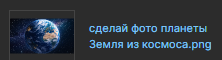

# Проект на Bootstrap 5

Примечания:
- Предполагается, что `favicon.ico` обслуживается сервером, но на всякий случай /favicon.ico создан и передаёт файл из static
- Первый текст на странице `<h1>` был одной ширины с `<p>`. Не получилось, поэтому они оба 750px
- Очень смешное название картинки из примеры было переименовано
  


- Много фоток конвертировано в jpeg -> png (компрессия)
- Текст `Золотая медаль по научным исследованиям` содержал странный `\n` символ, который заметил VSCode. Удалено.
- Жалко, что Django 5.2. Хотелось [partialdef](https://docs.djangoproject.com/en/6.0/ref/templates/builtins/#partialdef) использовать
- Не используется перевод (i18n), предполагается, что сайт всегда на русском
- Сделан вместо кнопки `Войти` переход в админку Django
- Аутентификация по кнопке `Войти` через админку Django
- В виде БД используется SQLite. MySQL не использован так как колонки (int, str, str) без проблем перенесутся в MySQL. Лень скачивать MySQL ради присутствия параметров в settings.py (я не предустанавливал его перед началом работы)
- Предполагается, что req.pip написан в формате requirements.txt

# Задание
```md
Необходимо собрать с помощью bootstrap 5 (https://getbootstrap.com/docs/5.0/getting-started/introduction/) и запустить новую страницу по макету 
https://www.figma.com/design/csU67B0SQVZO1AkwvMZa3D/

- сборку проекта осуществить с помощью python 3.12, Django 5.2 и MySQL
- проект разместить в git репозитории
- для сборки клиентской части страницы необходимо использовать bootstrap 5
- для запуска слайдера необходимо использовать slick slider http://kenwheeler.github.io/slick/ (см. Slider Syncing)
- по клику на большую фотографию на слайдере фотки должны открываться на весь экран и листаться галереей
- необходимо чтобы фотографии для слайдера заполнялись через админку Django. Необходимо настроить визуально понятный admin.py, чтобы выводилась картинка и название в списке записей элементов слайдера. Чтобы модели и поля отображались на русском языке.
- для картинок модели слайдера необходимо использовать пакет django-filer и через него грузить картинки в слайдер
- записи слайдера в админке должны сортироваться при помощи drag&drop, для этого необходимо использовать пакет django-admin-sortable2
- все зависимости для запуска проекта расположить в файле req.pip в корне проекта.

Акцентирую внимание, большая часть будущей работы будет на backend, но все же необходимо обладать компетенцией fullstack-разработчика.

Тестовое задание проверяет поверхностно основные навыки кандидата необходимые для текущей вакансии:
- умение работать с bootstrap 5;
- базовые знания HTML, CSS, JavaScript;
- умение запустить и собрать новый проект на Django, с подключением дополнительных пакетов;
- базовые навыки работы с GIT;
- базовые навыки работы с Figma.

Срок на реализацию задачи не ограничен, но необходимо в ответ сообщить, когда собираешься приступать к выполнению. 
Желательно выдать результат не позднее чем через 5 дней. 
Задача по оценке на примерно 4-6 боевых часов работы.
```